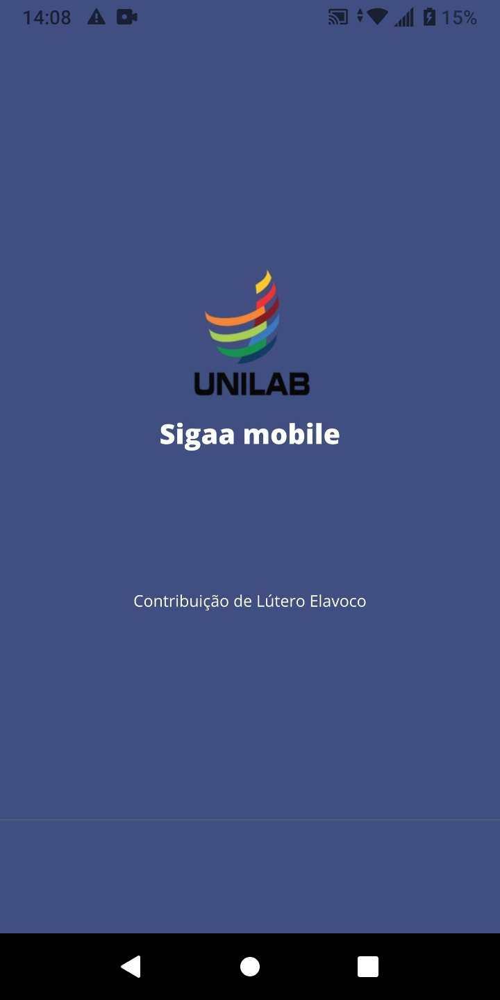
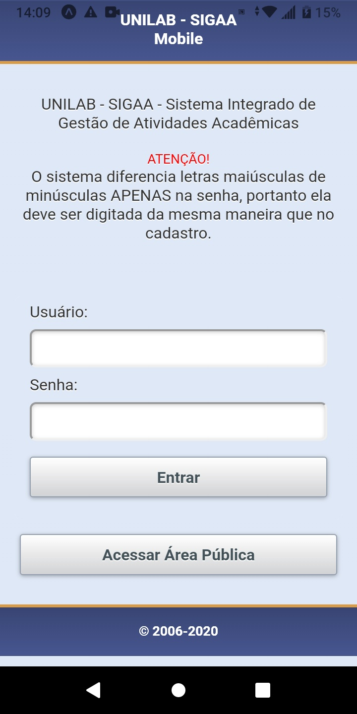
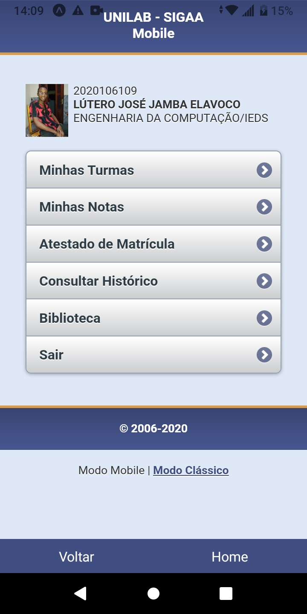
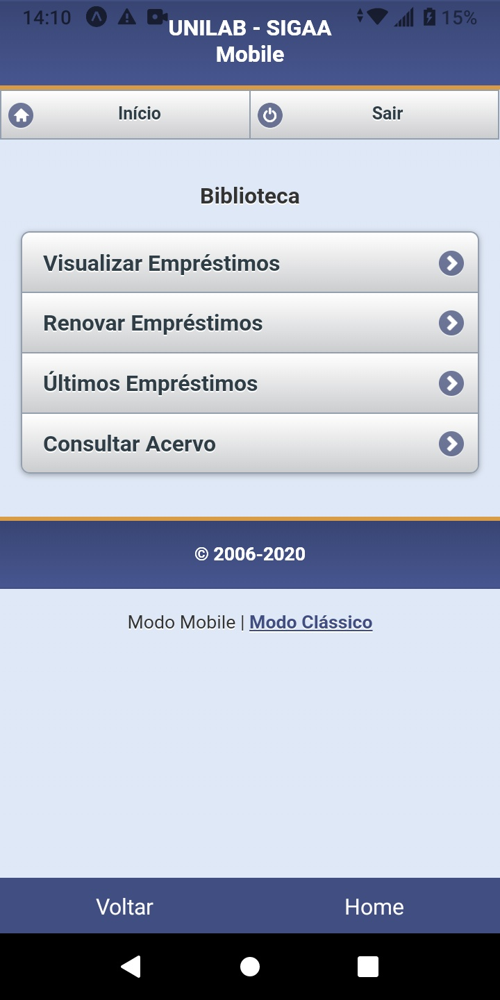

# Sigaa Unilab Mobile 
>A simple project to open Unilab Sigaa. 

In this project basicly i created a aplication that open the website in the mobile version. Often Student use the Google chrome to open de website, and is very difficult to decorate the url for this reason i decided to create this aplication. 




## Instalation 

Go to cmd and run the code below 

```sh
yarn install
```

After all dependecies installed

**To run**

```sh
yarn start 
```


**To build android and IOS **

```sh
expo build:android
```

```sh
expo build:ios
```


## This project screeshots

* Login screen 



* Home page


* Others page





## Meta

Author - Lútero Elavoco

programmer -  [Lutero Elavoco](https://www.linkedin.com/in/l%C3%BAtero-elavoco-5951b619b/) - luteroelavoco90@gmail.com

https://cientista1.github.io/instafrontend/#/

## Contributing 

1. Fork it (https://github.com/cientista1/sigaaunilab)
2. Create your feature branch (`git checkout -b feature/fooBar`)
3. Commit your changes (`git commit -am 'Add some fooBar'`)
4. Push to the branch (`git push origin feature/fooBar`)
5. Create a new Pull Request

